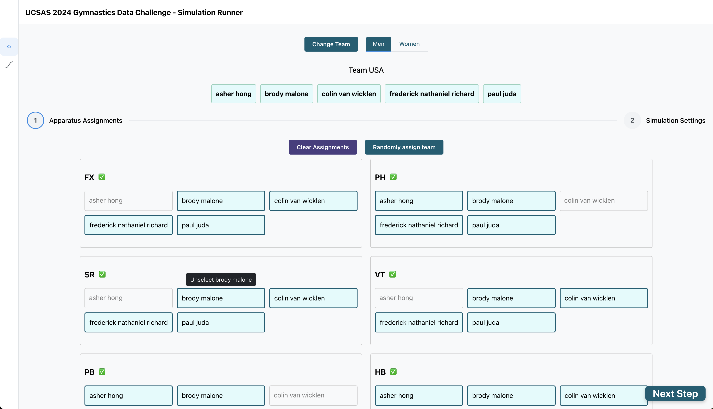
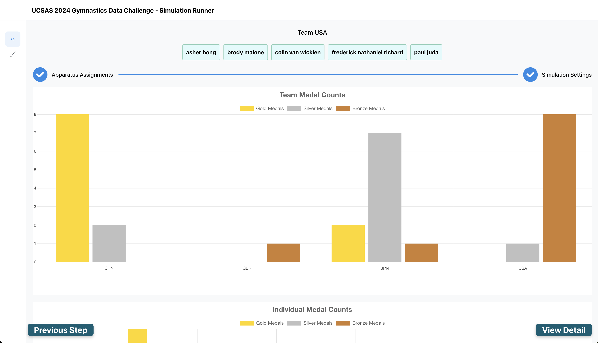

# Client

This is a [Next.js](https://nextjs.org/) project bootstrapped with [`create-next-app`](https://github.com/vercel/next.js/tree/canary/packages/create-next-app).

## Prerequisites

You must have the following installed:

- [Node.js](https://nodejs.org/en/)
- [npm](https://www.npmjs.com/)

Morover, the following must be true:

- The server is running. See [`server/README.md`](../server/README.md) for instructions.
- The data for the client must have been processed via [`server/R/script.prepare_data_and_models.R`](../server/R/script.prepare_data_and_models.R)
- To use the data explorer, you must have run simulations offline and processed them with the scripts [`server/run_simulations.R`](../server/run_simulations.R) and [`server/process_simulations.R`](../server/process_simulations.R), respectively.

## Getting Started

First, ensure all packages are installed by executing the following command in `client/` directory:

```bash
npm install
```

To run the development server execute the following command in the `client/` directory,

```bash
npm run dev
```

Alternatively, you can run the production server (which is what is used in production) by executing the following commands in the `client/` directory:

```bash
npm run build
npm run start
```

Open [http://localhost:3000](http://localhost:3000) with your browser to see the result.

## Pages

There are two pages:

- `/` is the home page, which contains the simulation runner.
- `/explorer` is the simulation explorer.

### Simulation Runner

The simulation runner allows you to run simulations and view the results.




### Simulation Explorer

The simulation explorer allows you to view the results of simulations that have been run offline.
The views are similar to those in the simulation runner, but the explorer allows you to view multiple different
apparatus assignments of the same team at once.

## Code Structure

This project follows the typical hierarchy of a NextJS application utilizing the `app` directory. Pages
are located in `src/app`, while components, utility functions, and helpers are located in `src/`.
The project makes use of [React Query](https://tanstack.com/query/latest/) for data fetching and caching.
